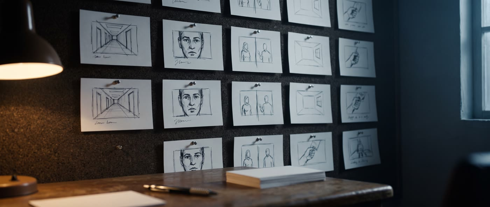

<div align="center">



# ai-film

**A production methodology for narrative short films made with AI video models — and the failure catalogue behind it.**

Every rule in this repository cost a render to learn.

[](LICENSE)
[](skills/ai-film/SKILL.md)
[](#requirements)
[](#model-support)

</div>

---

## What this is

Most AI-filmmaking repos give you prompt templates. This one gives you the list of
things that go wrong, and what actually fixed them.

It grew out of a run of narrative shorts — 60 to 230 seconds, seven to nineteen
shots, recurring characters, spoken dialogue, originals and remakes, colour and black
and white. The
interesting output was not the films. It was the defect log: the shot that came back
with the wrong actor's face, the score that failed moderation *after* the render was
paid for, the 120-second film that silently concatenated to 91.5 seconds and exited 0.

Those are all in here, with the fix that worked and the fixes that didn't.

**The one rule everything else follows from:**

> The model executes descriptions. It does not execute negations. And it fills every
> space you leave it.

Nine defects out of ten are fixed by *changing what you described*, not by adding
another `NO …`. Measured, repeatedly:

| Defect | Adding a negative | Changing the description |
|---|---|---|
| Extras appearing on a small boat | failed twice | fixed first try — *"shoot the whole boat bow to stern so the people can be counted"* |
| A hat bleeding in from a reference photo | failed | fixed — supply a **clean reference photo** |
| Calligraphy laid out wrong | failed twice | fixed — describe the physical sheet, not the forbidden layout |
| Two leads swapped for an entire film | n/a | fixed — remove the body-type adjectives fighting the photos |
| A second pistol in a stand-off | n/a | fixed — *"exactly one revolver, the one in her two hands"* instead of a position in frame |

---

## Quick start

```bash
git clone https://github.com/KeWang0622/ai-film.git
cd ai-film && ./install.sh          # copies the skill into ~/.claude/skills/
```

Then, in Claude Code:

```
> make me a 90-second short about a night bus driver on the last run of a route
```

Or drive the pipeline directly:

```bash
cd skills/ai-film/templates

export PIKA_API_KEY=...                  # or PIKA_API_KEY=... in templates/.env.local
cp shots_template.py shots_myfilm.py     # write your scenes and CAUSAL_CHAIN
./check_script.py --project myfilm       # lint before you spend a cent
./check_script.py --project myfilm --script   # read the dialogue as a stranger
./pika_client.py upload refs/*.jpg > refs.json   # refs/<key>-1.jpg, refs/<key>-2.jpg
./generate.py    --project myfilm --dry-run
./generate.py    --project myfilm        # paid, ~15 min for 17 shots at 6 parallel
./audit_faces.py --project myfilm        # then LOOK at the sheets
./finish.py      --project myfilm        # free, re-runnable forever
./verify_film.py --project myfilm --cut myfilm-nomusic.mp4
./deliver.py     myfilm-nomusic.mp4 --share-mb 25
```

---

## The pipeline

Generation is paid and slow. Post is free and endlessly re-runnable. Keeping them
in separate scripts is the most important structural decision in the repo —
subtitles, transitions, fonts, score and mixing get re-run dozens of times without
spending again.

```mermaid
flowchart LR
    A["shots_project.py<br/><i>scenes, identity,<br/>props, dialogue</i>"] --> B{{"check_script.py<br/><i>lint — free</i>"}}
    B --> C["generate.py<br/><b>paid · slow</b>"]
    C --> D["out_project/*.mp4"]
    D --> E{{"audit_faces.py<br/><i>crop · compare · judge</i>"}}
    E -->|defect| C
    E -->|clean| F["finish.py<br/><b>free · re-runnable</b>"]
    F --> G["concat · grade<br/><i>picture-only dips</i>"]
    G --> H["subtitles · score<br/><i>both optional</i>"]
    H --> V{{"verify_film.py<br/><i>measure the cut</i>"}}
    V --> J["deliver.py<br/><i>MASTER · full · share</i>"]

    style C fill:#D97757,stroke:#8f4a33,color:#fff
    style F fill:#2d6a4f,stroke:#1b4332,color:#fff
    style E fill:#1d3557,stroke:#0d1b2a,color:#fff
    style B fill:#1d3557,stroke:#0d1b2a,color:#fff
    style V fill:#1d3557,stroke:#0d1b2a,color:#fff
```



---

## What's in the box

```
skills/ai-film/
├── SKILL.md                  the methodology, as an agent skill
├── references/
│   ├── story.md              the object, the promise, the rhyming shot, act structure
│   ├── identity.md           keeping one face across forty shots — read this first
│   ├── prompting.md          prompt anatomy, the six shot-design elements, failure catalogue
│   ├── postproduction.md     concat, subtitles, transitions, mixing, ffmpeg traps
│   └── delivery.md           encoding, faststart, hosting
└── templates/
    ├── shots_template.py     the shot script contract, heavily annotated
    ├── check_script.py       lints the script; --script prints the dialogue alone
    ├── pika_client.py        API client, standard library only; diagnoses 401/403/plan
    ├── generate.py           renders every shot; resumable, prompt-cap gate, real spend
    ├── audit_faces.py        contact sheets for identity verification
    ├── finish.py             concat, monochrome, grain, subtitles, optional score
    ├── verify_film.py        measures the cut instead of looking at it
    └── deliver.py            MASTER / full / share tiers, two-pass linear loudness

examples/last-run/            a complete 7-shot, 84-second worked example
```

---

## The rules worth knowing before you start

<details open>
<summary><b>Identity — the source of nearly every rerun</b></summary>

- **The photograph wins.** Never write a physical attribute that contradicts the
  reference photo. Two young men described as "lean, tall" and "heavy-set" — when the
  photos were the other way round — got **swapped for an entire film**. The model
  follows the adjective, not the `@ImageN` tag.
- **Distinguish by hardware that exists in the photo.** Glasses shape (square vs
  perfectly round) is the most reliable discriminator found. Build, height and face
  shape are not — they fool you in profile and in low light.
- **Two photos beat one, badly.** A single wide photo degrades into a *type* — "a bald
  bearded older man" instead of the actual person. A single clean *frontal* photo can
  hold across a whole film if the face stays large and front-on and a hardware anchor
  is named in every shot.
- **Never age a face.** One photograph per person for the entire film, every era. Time
  is carried by hair, wardrobe, props and set. This was corrected three times in one
  project before it stuck.
- **Whatever is in the photo leaks into the film.** A festive hat in a reference photo
  turned up in a Han-dynasty army camp. The fix is a clean photo, not a longer negative
  list.

</details>

<details open>
<summary><b>Story — the audit that caught what every other check missed</b></summary>

A remake passed every technical check — faces, colour, sync, lint — and its first
viewer still said *"I don't know what's going on."* Every break was a fact nobody said
out loud: a flashback's city first named five shots later, a heroine whose name was
never spoken, an ending that put three people on a plane with two travel permits.

- **Declare `CAUSAL_CHAIN`** — each fact a stranger needs, with the line that says it.
  The linter errors on any fact nobody speaks. It found a gap in this repo's own worked
  example.
- **`check_script.py --script`** prints only the dialogue. Read it cold.
- **Count every countable thing out loud.** Viewers do the arithmetic.
- **A famous line needs its own shot**, with silence directed before and after. Placed
  fourth of four lines in a 12-second shot, it was gone in a second and a half.

</details>

<details>
<summary><b>Prompting — shot design, not scene description</b></summary>

Six elements per shot. Without them you get a stock photo: subject-centred,
symmetrical, facing camera.

| Element | Without it |
|---|---|
| `LENS` | flat middle-distance perspective on everything |
| `FOREGROUND` | no depth — subjects look pasted onto the background |
| `FRAME` | subject dead-centre, symmetrical, no negative space |
| `BLOCKING` | actors stand still and pose instead of doing something |
| `EYELINE` | **actors look at the lens** — the most anti-cinematic result available |
| `MOVE` | either static, or drifting with no motivation |

And a seventh the hard way: **`MOTION`**. A locked-off camera means a disciplined
camera, not a still photograph. Without an explicit statement of what moves in the
world — light travelling, weather crossing, cloth lifting, machinery running — you
pay full price for a photograph with a slow zoom on it.

</details>

<details>
<summary><b>Audio — the ban that pays for itself</b></summary>

**Ban music in every prompt.** Without it the model composes a score, that score trips
a copyright fingerprint, and the job is rejected **after the video has finished
rendering**. You pay; you get nothing. Adding the ban took one batch from 5/6 to 6/6.

Title and end cards must declare silence *explicitly* — with nothing to say, the model
invents ambience and trips the same filter.

Past three speakers the model loses turn-taking and has two characters say the same
line in unison. Cap it, number the lines, and state that nobody speaks in unison.

</details>

<details>
<summary><b>Post-production — where the silent failures live</b></summary>

- **Use the concat *filter*, not the demuxer.** Source clips are HEVC; any clip
  re-encoded to add a fade becomes h264. The demuxer requires identical codecs, and
  mixing them drops ~25% of the runtime **and exits 0**. Observed: a 120s film came out
  91.5s with no error.
- **`fade=t=in:st=108` does not mean "fade in at 108s."** It renders every frame
  *before* 108s black. Two such filters turned an 86 MB master into 3.2 MB.
- **Normalise before transcribing.** Generated dialogue sits at −37 dBFS under
  ambience; fed raw, timings come back 10+ seconds out. After compansion, word
  timings land within ~0.2s.
- **Tokenise by language.** Transcription returns per-character tokens for Chinese and
  per-word tokens for English. Comparing letters to words matches nothing and yields an
  empty subtitle file with no error.
- **Never sort subtitle cues by timestamp.** Script order is the correct playback
  order; sorting reorders dialogue.
- **`-movflags +faststart` or the video looks broken over HTTP.** Local players do not
  care where `moov` sits, so this never appears in testing — only for your viewer.
- **Dips to black are picture-only.** A line that starts at 0.00s after a dip lost
  17 dB off its first syllable to the old audio fade. Sound now carries through.
- **Loudness is two-pass linear.** Single-pass `loudnorm` lifted a silent title card
  from −65 to −16 dBFS in a controlled test. Measure, then apply one gain.
- **Force black and white in post, and check the 95th percentile of chroma.** Whole
  shots have returned in colour under a black-and-white prompt; the mean hides them.

</details>

<details>
<summary><b>Verification is a procedure, not a glance</b></summary>

Three defects shipped past a "verified" wide frame: a soft out-of-focus face, a face
that had drifted to a stranger, and two leads swapped for a whole film.

```
For every shot with a face:
  1. Crop the face region and scale it up
  2. Put it beside the reference photograph
  3. Judge by glasses shape / hardware — not by face shape
  4. Confirm WHICH person is wearing WHICH costume
```

`audit_faces.py` builds the sheets. Exit code 0 means the sheets were written. It does
not mean they passed. `verify_film.py` then measures the cut — runtime, colour, music
the model slipped in, banding, speech under every dip, faststart — and treats any
measurement it cannot compute as a failure.

</details>

---

## Story architecture

Shot craft makes a film look expensive. Three devices make it land, and they cost
nothing:

**The object.** One small, ordinary, physical thing. Introduced early, handed over at
the crisis, completed at the end. Three appearances, never four. The audience cannot
hold an abstraction across 120 seconds but will track an object effortlessly.

**The promise.** A plain spoken line, established in act one, echoed at the turn, paid
off at the end — with the speaker changed. That inversion is the whole payoff. The line
must survive being spoken three times, so anything writerly breaks.

**The rhyming shot.** Two scenes with an *identical* setup — same lens, framing, move,
blocking — separated by the turn. Nothing about the composition changes; everything
about the meaning does.

The example film uses all three. So does every film this repo came from.

---

## Worked example

[`examples/last-run/`](examples/last-run) — **Last Run**, 7 shots, 84 seconds. A night
bus driver, a passenger who rides every night, and a paper transfer ticket.

It is deliberately small enough to render cheaply and complete enough to exercise
everything: the object's three beats, the promise and its inversion, a rhyming shot,
two empty plates that route to text-to-video, and one hands-only scene with no faces at
all.

```console
$ ./check_script.py --project lastrun
  ·  7 shots / 84s = 1:24
  ·  3/6 boundaries are hard cuts

no errors, 0 warning(s)
```

---

## Cost

Measured from a billing endpoint, which is far more reliable than reasoning about list
prices — a naive estimate once read 4× high.

| Operation | Measured |
|---|---|
| `seedance-2.5`, reference- or text-to-video, 1080p, 4:3 or 21:9 | **$0.46/s** (0.457–0.460 across 60+ renders) |
| `seedance-2.0-fast/reference-to-video` | ~$0.83/shot |
| instrumental score (MiniMax), per call | $0.09; ~105–170 s, no duration control |
| word-level transcription | ~$0.004/min |

A 200-second film lands around **$92 before reruns**. Iteration on two remakes added
24% and 133% — the second because the story was rewritten twice after a viewing. Explore with the cheap models;
finalise with the expensive one. Concurrency is capped server-side — exceeding it
returns 429 on *uploads* too, which is a confusing way to discover the limit.

**Variants are cheap.** An alternate ending overrides only the shots that change.
Another language reuses every shot design and swaps only the dialogue. Re-mixing,
re-subtitling and re-grading are free.

---

## Model support

The methodology is model-agnostic — the identity, story and post-production rules hold
across any reference-to-video model. The templates ship wired to Seedance 2.5 through
`pika_client.py`, a standard-library client for the published API
([index](https://dev.pika.art/llms.txt)). Nothing to install.

Porting to another backend means replacing `pika_client.py`'s `submit`, `wait` and
`asset_url`. Everything downstream operates on `.mp4` files.

## Requirements

- Python 3.10+
- `ffmpeg` and `ffprobe` on `PATH`
- A CJK-capable font for Chinese subtitles (`Droid Sans Fallback` or WenQuanYi);
  override with `AI_FILM_FONT_CJK` / `AI_FILM_FONT_LATIN`
- `numpy` for `verify_film.py`
- For generation only: an API key (`PIKA_API_KEY`) whose plan includes the video model

---

## Rights and responsible use

This matters more than any technical rule here, and it is not optional.

- **Do not use a real person's likeness as a reference image** unless they gave you the
  photograph for this purpose. Generate an original character instead — it works, and
  it has carried leads across many films.
- **Swapping the faces does not change what the text is about.** If a script
  dramatises a real, identifiable person's private life, recasting it with lookalikes
  or generated faces does not make it fiction.
- Do not dramatise live litigation or unproven allegations about named real people.
- Source premises from the public domain, historical events, or genre archetypes, with
  original characters, original dialogue and an original recurring object. State the
  originality contract in your shot script's docstring so it stays true as the script
  evolves.
- **Remakes:** plot ideas are not protected and titles and short phrases are not
  copyrightable; extended dialogue and specific written scenes are. Keep the beats and
  the iconography, quote at most a famous short line, write every other line fresh, and
  take more care with a close remake you distribute publicly than with a private one.
- **Not-showing is a craft tool, not just a constraint.** An antagonist as a gloved
  hand and a shadow; a dying parent as a cough behind a screen. Each is stronger than
  showing the face, and each removes an identity risk for free.

---

## Related work

A genuinely good ecosystem exists. Most of it solves a different half of the problem —
these are prompt libraries, agent frameworks and rendering toolchains, where this repo
is a failure catalogue plus a thin pipeline. They compose well.

| Project | What it does |
|---|---|
| [ViMax](https://github.com/hkuds/vimax) | Agentic framework: narrative planning → consistency → generation → assembly |
| [OpenMontage](https://github.com/calesthio/OpenMontage) | Large agentic video production system; 12 pipelines, 100+ tools |
| [DirectorSKILL](https://github.com/wuwangzhang1216/DirectorSKILL) | Script → shot list → keyframe and motion prompts, with director-style overlays |
| [visual-skills](https://github.com/smixs/visual-skills) | Cinematic dramaturgy plus exact prompt syntax for Seedance / Kling / Veo |
| [video-shotcraft](https://github.com/Vincentwei1021/video-shotcraft) | Remotion-based motion design; shot recipe cards and motion previews |
| [claude-remotion-skill](https://github.com/haidrrrry/claude-remotion-skill) | Programmatic motion graphics, B-roll, captions, sound design |
| [ai-video-generation-pipeline](https://github.com/SainathPattipati/ai-video-generation-pipeline) | End-to-end script → storyboard → characters → video with a consistency engine |
| [agent-media-skill](https://github.com/yuvalsuede/agent-media-skill) | Claude Code skill for image and video generation via a media CLI |

---

## Changelog

**Two remakes and a recut** — lessons from a 1942 black-and-white romance and a
modern spy-marriage comedy, both recast with leads in their seventies.

- **Runs out of the box.** `pika_client.py` replaces the private SDK the pipeline used
  to import; `generate.py` is resumable, gates on the 15,000-character prompt cap,
  reports real spend, and says whether a failure is a bad key, a deactivated key, or a
  plan without the model.
- **Story audit.** `CAUSAL_CHAIN` and `check_script.py --script`; new lint for montages
  inside one generation, weapons without a headcount, and photographs as set dressing.
- **Post fixes, each measured.** Picture-only dips; monochrome forced in post; grain in
  post with `-tune grain`; two-pass linear loudness; fades timed from real clip length.
- **New tools.** `verify_film.py` measures a cut; `deliver.py` builds three tiers and
  never upscales.
- **Docs.** The stranger audit, counting resources, remakes with a happy ending, key
  lines, faceless flashbacks, single-photo identity, hats, wardrobe continuity, and a
  fix to the worked example, which never said its route was ending.
- **SKILL.md prices are written `USD 0.45`.** A dollar sign followed by a digit is
  substituted as a positional argument when the skill is invoked with arguments.

## Contributing

The most valuable contribution is **a defect and its fix**. If a rule here fails for
you, or you find a new failure mode, open an issue with the symptom, what you tried,
and what actually worked. See [CONTRIBUTING.md](CONTRIBUTING.md).

## License

[MIT](LICENSE).
